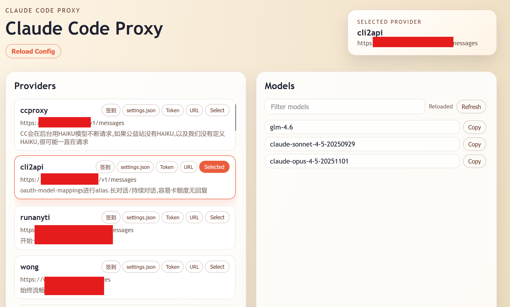

# Claude Code Proxy

[简体中文](README_zh.md)

Claude Code Proxy is a lightweight reverse proxy tool designed for Claude Code users. Switch between multiple Claude API providers via Web UI, with automatic model list fetching, JSON config hot-reload, without restarting Claude Code.

**Use cases:** Manage multiple public/forwarding API keys, test endpoint stability, centralize Claude API access management.



## Quick start

1) Copy the example config:

```bash
copy config.in.json config.json
```

2) Edit `config.json`:

- `HOST` / `PORT`: Proxy server address (e.g., `127.0.0.1:3456`)
- `APIKEY`: Authentication key for Claude Code - also used as Web UI password
- `Providers`: Your upstream provider list

3) Start proxy (default config is `config.json`):

```bash
python ccproxy.py --config config.json
```

4) Configure Claude Code to use this proxy:

```json
{
  "env": {
    "ANTHROPIC_AUTH_TOKEN": "<APIKEY>",
    "ANTHROPIC_BASE_URL": "http://127.0.0.1:3456"
  }
}
```

Replace `<APIKEY>` with the `APIKEY` value from your `config.json`.

5) Open the Web UI to switch providers:

```
http://127.0.0.1:3456
```

Browser will ask for Basic Auth - password is your `APIKEY` (username can be anything).

## Config files

- `config.in.json`: example config
- `config.json`: active config
- `proxy_state.json`: stores last selection + auth overrides; safe to delete (UI will fall back to first provider).

## Auth overrides

Each provider can override how tokens are sent:
- `token_in`: `header` / `query` / `both`
- `token_header`: default `Authorization`
- `token_header_format`: default `Bearer {token}`

These overrides only affect runtime routing. Update `config.json` and click **Reload Config** to apply file changes.

## Notes

- Thanks to https://github.com/musistudio/claude-code-router
- `config.json` follows the [ccr](https://github.com/musistudio/claude-code-router) format, but this project does not provide model conversion (OpenAI/DeepSeek/etc.).
- This proxy is a simple reverse proxy, intended for upstreams that already expose Claude-compatible endpoints (public gateways/official/GLM, etc.). Use `/model <name>` in Claude Code to select a model per provider (the UI copy button provides the exact command).

## Background run (Linux)

```bash
./run.sh start
./run.sh stop
./run.sh restart
./run.sh status
```

Logs: `ccproxy.log`  |  PID: `ccproxy.pid`
