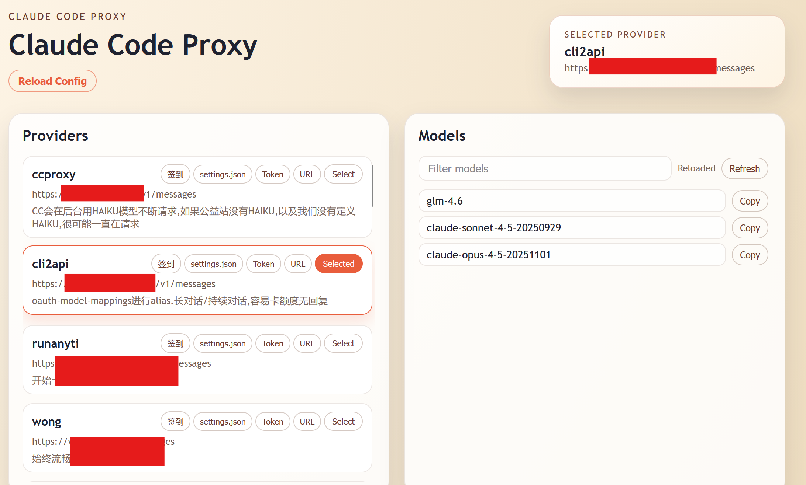

# Claude Code Proxy

[English](README.md)

轻量级 Claude API 反向代理工具，提供 Web UI 管理多个供应商，支持自动模型发现、即时切换、HTTP 覆写、批量测试等功能。



## 核心功能

- **自动模型发现** - 从供应商 `/v1/models` 自动获取模型列表
- **即时切换** - Web UI 切换供应商，无需重启 Claude Code
- **快速复制** - 一键复制 URL、API key、`/model xxx` 命令
- **批量测试** - 一键刷新并测试所有供应商，保持账户活跃
- **HTTP 覆写** - 伪装客户端特征（User-Agent、请求体等），绕过站点检测
- **热重载** - 修改 `config.json` 后通过 UI 重新加载

## 快速开始

```bash
# 1. 复制配置
cp config.in.json config.json

# 2. 编辑 config.json 添加供应商

# 3. 启动代理
python ccproxy.py --config config.json

# 4. 配置 Claude Code (~/.claude/config.json)
{
  "env": {
    "ANTHROPIC_AUTH_TOKEN": "<你的APIKEY>",
    "ANTHROPIC_BASE_URL": "http://127.0.0.1:3456",
    "CLAUDE_CODE_DISABLE_NONESSENTIAL_TRAFFIC": "1"
  }
}

# 5. 访问 Web UI
# http://127.0.0.1:3456 (密码是你的 APIKEY)
```

## 配置

```json
{
  "HOST": "0.0.0.0",
  "PORT": 3456,
  "APIKEY": "sk-your-key",
  "ERROR_THRESHOLD": 3,
  "HeaderOverrides": {
    "ClaudeCode": {
      "User-Agent": "claude-cli/2.0.76 (external, cli)",
      "x-app": "cli"
    }
  },
  "RequestOverrides": {
    "ClaudeCode": {
      "tools": []
    }
  },
  "Providers": [
    {
      "name": "供应商名称",
      "api_base_url": "https://api.example.com/v1/messages",
      "api_key": "sk-provider-key",
      "models": ["claude-sonnet-4-5-20250929"],
      "comment": "备注"
    }
  ]
}
```

**配置说明：**
- `ERROR_THRESHOLD` - 错误重试阈值，达到阈值后断开连接触发客户端重试
- `HeaderOverrides` - 请求头覆写预设，通过 Web UI 选择应用
- `RequestOverrides` - 请求体覆写预设，通过 Web UI 选择应用
- `comment`（可选）- 供应商备注，显示在卡片下方

**HTTP 覆写：**
- 统一的覆写配置，所有供应商共享
- 通过 Web UI 配置��token_in、header_override、request_override 等
- 支持透传模式和 Override 模式

## 新功能

**v2.0 更新：**
- ✅ 模块化架构 - 代码重构，职责清晰，易于维护
- ✅ 统一覆写配置 - 所有 provider 共享配置，切换时不重置
- ✅ Provider 测试 - 可配置模型和提示词，测试结果显示绿色/黑色
- ✅ Refresh & Test - 一键刷新并测试所有 provider，后台异步处理
- ✅ 完整日志 - 测试请求和响应完整记录到日志

**使用场景：**
- 定期点击 "Refresh & Test" 保持所有账户活跃
- 测试结果持久化，重启后保留（存储在内存中）
- 可关闭页面，后台继续���理

## 后台运行（Linux）

使用 `run.sh` 脚本管理后台进程：

```bash
./run.sh start    # 启动
./run.sh stop     # 停止
./run.sh restart  # 重启
./run.sh status   # 状态
```

日志：`ccproxy.log` | PID：`ccproxy.pid`

## 工具

**ccp_update_model.py** - 更新 ccproxy config.json 的模型列表
```bash
python tools/ccp_update_model.py --timeout 5 --filter "4-5,sonnet"
```

**ccp2ccr.py** - 转换配置为 claude-code-router 格式
```bash
bash tools/ccp2ccr.sh
```

**ccp2ccswitch.py** - 转换配置为 CC Switch SQL 格式
```bash
bash tools/ccp2ccswitch.sh
```

**ccp2cliproxy.py** - 转换配置为 CLIProxyAPI YAML 格式
```bash
bash tools/ccp2cliproxy.sh
```

详见 [tools/README.md](tools/README.md)

## 致谢

Claude Code, Codex, Antigravity

## 许可证

MIT
